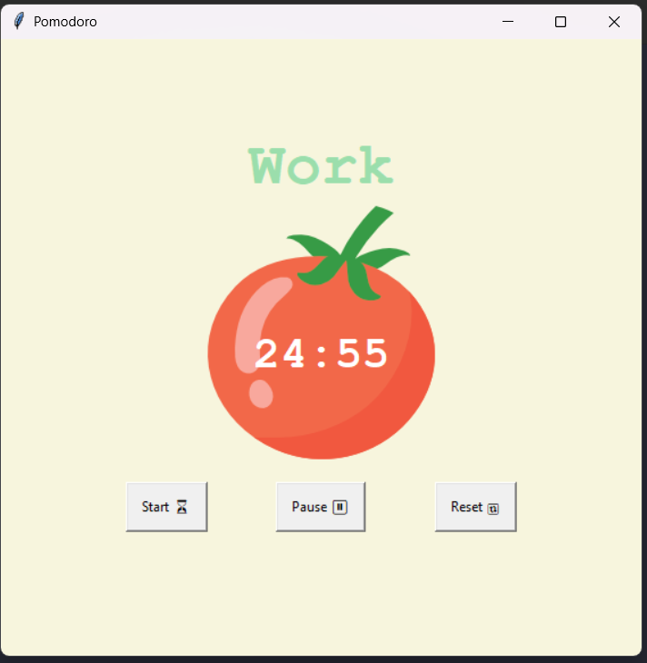

# Pomodoro Timer

A simple Pomodoro Timer built with Python and Tkinter that demonstrates the Pomodoro technique for productivity.

## Features

- Implements the Pomodoro Technique with configurable work, short break, and long break intervals.
- Pause and reset functionalities to manage your study sessions.
- Simple and intuitive UI built using Tkinter.

## Screenshot




## How to Run

1. Ensure Python (version 3.x) is installed.
2. Execute the application by running:
   ```
   python main.py
   ```

## License

This project is licensed under the MIT License.